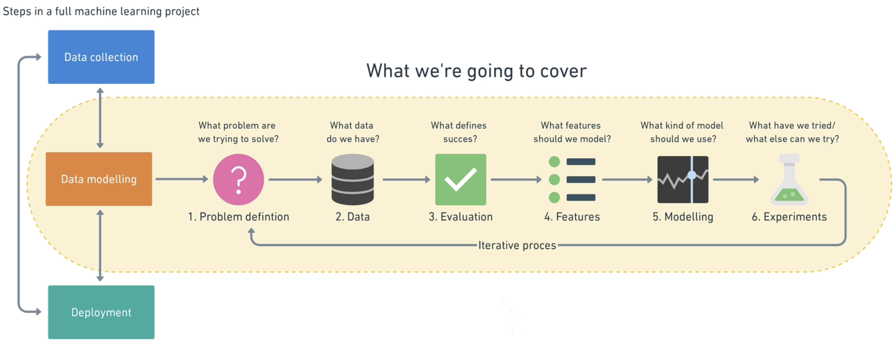

# Types of Machine Learning problems

A type of machine learning framework:

You start with **1. Problem Definition**

### When shouldn't you use machine learning?

Will a simple hand-coded instruction-based system work? If so, favor this over using machine learning.

### Main types of machine learning

-   Supervised Learning
-   Unsupervised Learning
-   Transfer Learning
-   Reinforcement Learning

## Supervised Learning

You have data and labels. Machine learning tries to use the data to predict the label. If it guesses the data wrong, it tries again, hence the name _supervised_.

Main types:

### Classification

Predicts if something is one thing or another.

-   "Is this example one thing or another?"
-   Binary classification = two options
-   Multi-class classification = more than two options

### Regression

Trying to predict a number.
Predicts if something is one thing or another.

-   "How much will this house sell for?"
-   "How many people will buy this app?"

## Unsupervised Learning

Has data but no labels. You might have customers' purchase history at your store and want to predict who would be interested in a specific product. You then create an algorithm that checks the commonalities based on the data you already have and put groups of similar examples together; otherwise known as _clustering_. A recommendation problem like recommending what music a user would like is an example.

## Transfer Learning

Leverages what a machine learning model has learned from another model. For example, you could have a model that knows how to identify a car brand/model from photos, and then use this to detect the breed of dogs based on pictures. The car-trained model already has foundational patterns that can be used for the other model.

## Reinforcement Learning

Having a computer program perform some action in a defined space and rewarding it for performing well or punishing it for doing poorly.

---

### Matching your problems

-   Supervised Learning: "I know my inputs and outputs."
-   Unsupervised Learning: "I am not sure of my outputs but I do have inputs."
-   Transfer Learning: "My problem may be similar to something else. Can I leverage another machine learning model's learning and use it on my own?"

---

## Credit

This information was from the course [**Complete Machine Learning & Data Science Bootcamp 2023**](https://www.udemy.com/course/complete-machine-learning-and-data-science-zero-to-mastery/).
